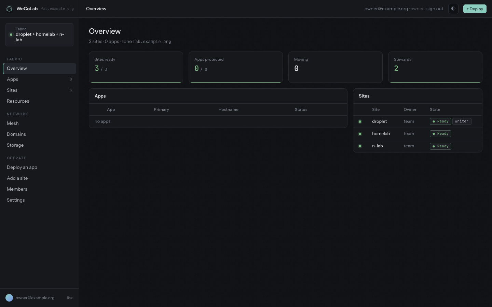
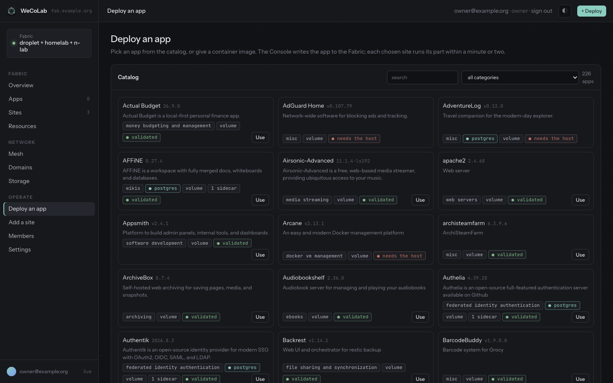
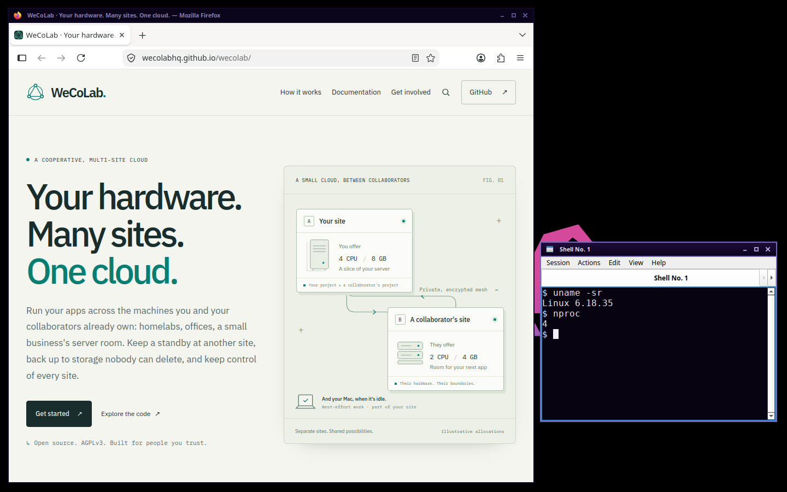
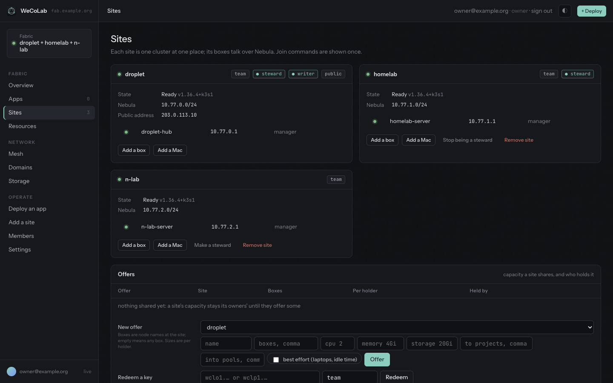

# The Console

The Console is WeCoLab's web interface, at `https://console.<zone>`. It shows what every site reports
about itself. Every change you make in it is a commit to the Fabric (the Git repository holding the
cooperative's desired state), with you as the author; each site's Flux applies the commit and its Warden
does the rest. This guide follows the pages in the order people meet them. Site, box, project, vault,
steward, writer, the Door and the other WeCoLab terms are explained, with their Kubernetes equivalents, in
the [glossary](glossary.md). [operations.md](operations.md) says what the fabric does in answer to each
action.

## Pages and who may use them

| Page | What it is for |
|---|---|
| Overview | counts, and a line for every app and site you may see |
| Apps | each app's checks; moving its primary, publishing it on the people mesh, deleting it |
| Sites | every site and its boxes; adding boxes and Macs; offers and pools of capacity |
| Resources | admins: each site's CPU, memory and pods, and where each workload runs |
| Mesh | adding your phone or laptop to the people mesh; admins also see every device and access rule |
| Domains | a project's own domain for app names |
| Storage | each project's vault, its databases' newest backup and WAL, and every volume at each site |
| Deploy an app | the catalog and the deploy form |
| Add a site | your SSH keys; admins invite a new site here |
| Members | admins: projects, invites and people |
| Settings | admins: the object storage key, the writer, the page's appearance |

Each person has one role on their Member, the Fabric's record of that person.

| Role | Who | May |
|---|---|---|
| owner | one person, made by the install | everything an admin may; the Console never edits, blocks or removes the owner |
| admin | invited as admin, or made admin | see and change everything: sites and stewards, people and projects, pools, the Resources, Members and Settings pages, taking over as writer, and every project's apps |
| member | invited as member | work in their own projects: deploy, move, publish on the mesh and delete apps, bring domains, create vaults, redeem offer and pool keys |

A member sees their projects' apps, domains, vaults and volumes, every site, every pool, and the offers
that concern their projects. The members of the project that owns a site also add and remove that site's
boxes and Macs, and make, key and withdraw its offers. Anyone signed in saves their own SSH keys.

The Console acts as you: its calls to its site's Kubernetes API carry your identity, so the RBAC Warden
binds from the Member records has the last word. A few steps it takes as itself once it has checked your
role and projects, such as invites, offers, keys and domains.

## Signing in

Open `https://console.<zone>`. The Console sends you to sign in with your email and the password your
invite link set. Sign-in is NetBird's own identity provider: the same account signs your devices in to the
people mesh. A session lasts seven days. What you may do is read from your Member on every request, so a
person blocked, removed or demoted loses it at once. Your email, your role and **sign out** are at the top
right.

If sign-in answers that your email is not a member of this fabric, the identity provider may still hold
someone else's session: sign out where the message says, and sign in again.

The development fabric has no sign-in: everyone is the owner ([development.md](development.md)).

## When something is refused

A refusal shows in red at the top of the page or beside the button, in the Console's own words, ending
with "(ref …)". Quote that reference to whoever runs the fabric: the Console's log has the request under
it, and so does the commit if one was made ([operations.md](operations.md#logs)).

"No answer from the Console" means the page got no reply at all, for example while the Console or the
Door restarts. The change may have been made anyway: refresh and look before trying again.

## Overview

Four counts, then a line for every app and every site:

- **Sites ready**: sites whose Warden answered, of all sites.
- **Apps protected**: apps whose every check but Promotion passes, of the apps you see ([Checks](#checks)).
- **Moving**: apps with a planned move in flight.
- **Stewards**: sites trusted with the fabric's secrets and its Nebula CA. It warns below two.

An app's line shows the site serving it now, its hostname, and **Protected** or the first check that
fails. A site's line shows its owner, Ready or not answering, and which site is the writer. Everything
comes from each site's own status report, which its Warden publishes over Nebula. The page refreshes every
ten seconds.

## Deploy an app

**Deploy an app** (or **+ Deploy** at the top) turns a catalog entry or a container image into an App:
the Fabric's record of one application, its sites, its primary and its hostname.

### The form

| Field | Meaning |
|---|---|
| Name | lowercase letters, digits and inner dashes, at most 32 characters, not a name the fabric keeps (`console`, `mesh`, `www`, the system namespaces and a few more). Also the default hostname. |
| Project | the project the app belongs to: its namespace at every site. You must be a member of it; admins may name any. |
| Image, Port | the container image and the port it listens on (8080 when empty). A catalog entry fills and locks both. |
| Hostname | empty means `<name>.<zone>`. Under the zone, a hostname is one free label. Any other hostname must fall under a verified domain of the project ([Domains](#domains)). No two apps share a hostname. |
| Sites | where the app runs. Only sites the project owns or holds an offer at, directly or through a pool, are listed; the first two are ticked. |
| Primary | the site that serves the app and, with a database, writes it. The first ticked site unless you pick another. |
| Postgres, replicated, backed up | a CloudNativePG database ([below](#the-database-its-vault-and-its-backups)). A catalog entry sets it. |
| Publish on the mesh | also serve the app to people's devices on the people mesh ([below](#publishing-on-the-mesh)). |
| Vault | appears with Postgres; used only when the project has no vault yet ([Storage](#storage)). |
| RPO | the recovery point objective, `5m` by default ([below](#the-database-its-vault-and-its-backups)). |

### The catalog

The catalog holds WeCoLab's own [Workspace](#workspaces), first, and 226 apps imported from the HomelabOS
catalog on 2026-09-28. Search it or pick a category; at most 60 cards show at once. A card shows the app's
version, its category and tags: **own VM** and **mesh only** (a workspace), **postgres** (it has a
database), **volume** (it keeps files on volumes), the number of sidecars, and one of:

- **validated**: it passed HomelabOS's own validation on a single amd64 droplet, whose backup check stops
  the app, archives its data and volumes, wipes, restores and reads back. It is not a test on WeCoLab.
- **incompatible**: HomelabOS found it broken as packaged (an image never published, a dead upstream).
- **environment blocked**: HomelabOS could not validate it without outside accounts or fixtures.
- **host incompatible**: refused, with no Use button; hovering shows why. Unlike *incompatible*, the app
  may work, but it needs what WeCoLab refuses a project's pod: the Docker socket, extra capabilities such
  as `NET_ADMIN`, the host's network, devices, privileged mode, or a custom Postgres image (CloudNativePG
  runs plain Postgres).

Most entries (173 of the 226) keep all their data on volumes, which are neither replicated nor backed up
([Where an app's data lives](#where-an-apps-data-lives)).

**Use** fills in the name (the entry's own), the image, the port and Postgres, and lists what the app gets
and what needs attention. **clear** drops the entry. A catalog app gets:

- its main container, requesting 100m CPU and 128Mi, limited to 1Gi of memory, with the entry's
  environment: database fields from the database's own Secret, generated secrets from the app's Secret
  `<app>`, and the hostname and zone filled in;
- its sidecars, in the same pod, each requesting 50m and 64Mi, limited to 1Gi;
- one 5Gi volume (a PersistentVolumeClaim) per data path, at each of its sites;
- a database, when the entry has Postgres.

Attention notes:

- *publishes extra ports the Door does not route*: the Door serves one HTTP port per app, through 443.
  Its other ports are not reachable from outside.
- *reads an env_file the import cannot see*: settings from that file are missing.
- *unresolved settings: ...*: the import could not fill them, and the Console leaves them empty.
- *sets sysctls*, *security_opt: ...*: the Console does not apply them.

When an entry generates an admin password, the Console shows it once after the first deploy, with the user
`admin`. It stays in the app's Secret `<app>`, key `admin_password`. Where an entry asks for an admin
email, it gets yours.

### An image

An app from an image gets one container and one replica, with the Recreate strategy (the old pod stops
before the new one starts), and a Service on port 80 to the given port. It requests 100m CPU and 128Mi and
may use at most 512Mi of memory. It has no environment variables and no volumes, except `DATABASE_URL`
with Postgres: files it writes live in the container and go when the pod is replaced.

Every app's pods run in user namespaces: root inside a container is an unprivileged user on the box
([security.md](security.md)). A workspace's run in their own VM instead (below).

### Workspaces

A **Workspace** is a Linux desktop in your browser: [Selkies](https://github.com/selkies-project/selkies)
streams an Ubuntu desktop (LXQt, Firefox, a terminal) over one WebSocket. It is deployed from the catalog
like any app, and differs in three ways.

- **Its own VM.** The pod runs under Kata Containers (`runtimeClassName: kata-clh`): its own kernel, in a
  small VM, so nothing inside shares the box's kernel ([decision 26](decisions.md)). Kata is installed on a
  site's amd64 boxes that have KVM, which install.sh labels `wecolab.io/kvm=true`. At a site with none, the
  workspace waits to be scheduled. A Mac's VM has no KVM, so a laptop never runs one.
- **On the mesh only.** It has no public hostname, and the form hides the field: it answers at
  `<name>-<project>.mesh.<zone>`, to devices on the people mesh ([Mesh](#mesh)). Selkies then asks for the
  user `admin` and the password the Console showed once after the first deploy.
- **Sized for a desktop.** It requests 1 CPU and 2Gi and may use 4 CPUs and 6Gi, plus Kata's 250m and 130Mi
  for the VM. A 2Gi `/dev/shm` in memory keeps its browser from crashing. Its home, `/home/ubuntu`, is a 5Gi
  volume at each of its sites, which a move does not carry.

Its sites, primary, moves and deletion are as for any app.

### What happens next

The Console tries every object as you, then commits the App and its folder to the Fabric in one commit.
Within a minute or two each chosen site's Flux applies the folder and its Warden gives the site its part:

1. the Deployment and the Service, in the project's namespace;
2. with Postgres, a CloudNativePG cluster: the primary at the primary site, and a replica at every other
   site, fed from the vault;
3. a route at the Door for the hostname, with a certificate, to the primary;
4. the App's checks on the Apps page. The Overview shows it **Protected** once every check but Promotion
   passes.

With a database, the app runs only at its primary; its other sites keep a standby database and no app pod.
Without one, every site of the app runs its own copy.

### The database, its vault and its backups

With Postgres, every site of the app gets a CloudNativePG cluster named `<app>-db`: one instance with 20Gi
of storage, requesting 250m CPU and 512Mi, limited to 1Gi of memory. The database and its owner are both
named after the app. The app finds its database through `DATABASE_URL`, from the Secret `<app>-db-app`,
key `uri`; catalog apps take the fields they need from the same Secret. The Console generates its password
once and every site gets the same Secret, so moving the app never changes it.

The primary archives its WAL (PostgreSQL's write-ahead log) to the project's vault within 60 seconds of a
write (`archive_timeout`; an idle primary archives nothing), through CloudNativePG's Barman Cloud plugin,
under `s3://<bucket>/<project>/<app>/`. It takes a base backup at once, then every night at 02:00. The vault
keeps what 30 days of recovery need. Every other site's replica replays the archive from the vault. A
project's first database app needs a vault ([Storage](#storage)).

The RPO changes nothing about archiving. It is the objective the WithinRPO check reports the newest
archived WAL's age against, and an idle primary whose newest WAL is older still passes.

### Where an app's data lives

- The database is replicated to every site of the app through the vault, and backed up there.
- Volumes hold files on one site's disk. They are never replicated and never backed up.
- An app without a database runs a separate copy at every site it names, each with its own volumes. The
  Door sends people to the primary's copy.
- After a move the database follows and the files do not: the app sees the new site's volumes, empty or
  old.
- Taking an app off a site, or deleting it, deletes that site's volumes for good.
- **Protected** never looks at volumes. A catalog app that keeps files on volumes shows Protected at two
  sites while each of its files exists at one site.

### Public names and your own domains

Every app answers at its hostname through the Door, the fabric's public entrance, with a certificate from
Let's Encrypt. The Door forwards to the app's primary site, over Nebula, and follows the primary when it
moves. `<name>.<zone>` needs nothing more; a hostname under a project's own domain needs that domain
verified first ([Domains](#domains)).

### Publishing on the mesh

**Publish on the mesh**, in the form or on the app's card, also serves the app at
`<name>-<project>.mesh.<zone>`, to devices on the people mesh (NetBird) only. The public hostname stays; a
workspace has none, and is on the mesh only.
The mesh name must be one DNS label of at most 63 characters that no other app has. **Unpublish** takes it
away.

## Apps

The Apps page shows the apps of your projects; admins see every app. A card shows the public link; the mesh
link, or **Publish on the mesh**; **Delete app**; the primary, the sites and the RPO; a button per site,
the primary's highlighted; and the app's checks. Tags say **postgres**, **moving from** one site **to**
another, or **deleting**.

### Checks

Each check is a condition on the App, computed from what its sites report now.

| Check | Passes when | Common reasons it does not |
|---|---|---|
| PrimaryHealthy | the primary site answers and, with a database, its cluster is healthy with a current primary | `SiteNotReady`, `DatabaseNotHealthy` |
| StandbyStaged | the standby site (the app's first other site, or a move's target) answers and, with a database, its replica has a ready instance built for its current archive | `NoStandby` (the app names one site), `SiteNotReady`, `ReplicaNotReady`, `Rebuilding` |
| WithinRPO | there is no database, or the primary archives WAL continuously and the standby's replica is healthy | `ArchiveStalled`, `ReplicaNotHealthy`, `NoWAL` |
| VaultFresh | there is no database, or the vault answers, has a default Object Lock retention, and holds a base backup less than a day old | `VaultUnreachable`, `NoObjectLock`, `NoBackup`, `Stale` |
| Routed | a ready pod of the app answers at the primary, for the Door to send people to | `DoorUnreachable` |
| Promotion | no move is in flight (`Applied`) | `Demoting`, `Promoting` (a planned move); `DatabaseMissing`, `RebuildWaiting`, `Rebuilding` |

**Protected** (the App's Ready condition) needs every check but Promotion. An app at one site is never
Protected: StandbyStaged needs a second site, with or without a database.

### Moving the primary

Click the site you want as primary. The dialog names the kind of move and, for an app with a database,
shows the checks a planned move needs (StandbyStaged, and for a new move PrimaryHealthy and WithinRPO) as
the Apps page has them, that is for the app's first standby, not necessarily the site you clicked.
**Change primary** commits the move; the Console checks again for the site you clicked, and that decides.

**Planned switchover.** An app with a database whose primary is healthy, with Force not ticked. On Change
primary the Console checks StandbyStaged for the target and, for a new move, PrimaryHealthy, WithinRPO and
that the primary is writable; when one fails it refuses and names it. VaultFresh and Routed do not stop a
move. The old primary then stops taking writes and hands a token to the target, which promotes with it
(CloudNativePG's demotion and promotion token). No database data is lost. The app is stopped from the
commit until the handover is done, typically under two minutes. Files on its volumes stay at the old
primary. The Overview counts the app under Moving, and Promotion says Demoting, then Promoting.

**Forced failover.** Tick Force. The target becomes the primary at once, without a handover and without
checks. Writes the old primary had not archived are lost: about the last minute while its archiving worked,
more if it had stalled. Every other site's database, the old primary's included when it returns, is rebuilt
from the vault. Use it when the old primary is gone. Force only to a site that has the database: anywhere
else the app stays stopped with `DatabaseMissing`. For an app with a database whose primary is not healthy,
a new move without Force is refused.

**An app without a database.** There is nothing to hand over and nothing is checked. The primary changes
at once, and the Door sends people to the new site's copy, with that site's own volumes.

Retargeting and cancelling a planned move are in [operations.md](operations.md#apps).

### Changing an app

Deploy it again with the same name and project; for a catalog app, choose **Use** on the same entry first.
You may change the sites, the image and port, the hostname, the mesh and the RPO. The primary must stay the
current one, so it is never dropped from the sites: to change it, move it on the Apps page first. A redeploy
replaces the app's folder in the Fabric. The passwords and secrets generated the first time are kept, and
the admin password is not shown again. A site taken off the app deletes its database and its volumes once
the primary proves it holds the data (an app without a database: at once). An app that is being deleted
cannot be deployed again until it is gone.

### Deleting an app

**Delete app**, then confirm. The Console marks the App deleted in the Fabric. The Door stops serving it,
its card shows deleting, and every site's Warden removes its part: the Deployment, the database and the
volumes. Once every site of the app reports nothing left, the writer removes the App from the Fabric; a
site that is down holds it until it is back. The vault keeps the backups: nobody can delete them before
their Object Lock expires.
The same name can be deployed again once the App is gone.

## Storage

A vault is one object storage bucket per project, with Object Lock so nobody can delete a backup in it.
The Storage page shows the vaults of your projects: each one's bucket and endpoint, and for each database
app its database, newest base backup, newest WAL and Object Lock mode, as the app's primary sees them.
Below, **Volumes** lists every volume of your projects' apps, its size, and what each site made of it
(Bound, with its capacity, or still pending).

**Create a vault.** When Settings holds the B2 account key, a project without a vault shows **Create
vault**. It makes a B2 bucket with Object Lock (compliance mode, 30 days) and a key that reaches only
that bucket, and keeps them, encrypted, in the Fabric.

**Rotate key.** Makes a new key for the vault's bucket and puts it in the Fabric for the project and its
apps. The old key stays valid until every site of the project's database apps has the new one; then the
writer deletes it at B2. Until then the vault shows the old key and the sites not yet reporting the new
one. Needs the account key in Settings; a bucket you brought yourself is rotated at its provider.

**Bring your own bucket.** Without the account key, or with another S3-compatible store, create the
bucket yourself with a default Object Lock retention (compliance, 30 days) and a key for it. Enter the
bucket, the endpoint (an `https` URL at a public address), the key id and the key under Vault in the Deploy
form of the project's first database app. They are kept for the project; later deploys ignore the fields.
A bucket without a default retention works, but VaultFresh stays false with `NoObjectLock`.

## Domains

Every app gets `<name>.<zone>` for free. A project may also bring its own domain, such as
`apps.example.com`:

1. On Domains, give the domain and the project, and choose **Add**.
2. At your DNS provider create the two records shown, DNS only (not proxied):
   `*.<domain> CNAME door.<zone>` (or A records to the Doors' addresses, which the page lists), and
   `_wecolab.<domain> TXT "wecolab=project:<project>"`.
3. The writer's Warden checks the records every two minutes until the domain is verified. The table
   shows Pending or Verified, the reason, and the last check.

Once verified, any hostname under the domain is accepted for that project's apps, with a certificate, and
no other project may claim the domain or a name under it. Several projects may claim a domain that is not
verified; the TXT record decides. **Remove** leaves running apps as they are until they are redeployed,
and leaves your DNS records in place.

## Mesh

The people mesh is NetBird: a private network for people's own phones and laptops. It is not Nebula, the
network between boxes. Boxes are not on it, except the Door, through which people reach mesh names.

**Add a device.** Install the NetBird app, choose the self-hosted management server
`https://mesh.<zone>` in its settings, connect, and sign in with your Console account. The device is
yours: it leaves the mesh when you are blocked or removed.

Admins also see every device, with its person, mesh address and when it was last seen, and every access
rule: which groups reach which, over which protocol and ports. A device joined with a setup key belongs to
nobody and stays when everyone is gone, so the page flags it. The Console only reads the mesh; the
writer's Warden keeps it in step with the Members.

## Sites and boxes

A site is one place's machines (a homelab, an office, a server room): one k3s cluster, owned by a project. A
box is one of its machines, a k3s node; the site's first box is its manager (the k3s server).

### The Sites page

Each site's card shows its owner and its tags (steward, writer, public), whether it answers and which
WeCoLab version it runs, its Nebula network, and its public address if it has one. Its boxes follow, each
with its Nebula address, its role (manager or node) and whether it is a laptop. Once the site reports a
box, the box also shows under its name its CPU and memory (its node's allocatable), and a Ready laptop
whether its person is active or idle.

- **Add a box** (members of the site's project, and admins) shows a join command for another Linux box at
  that site. Run it as root on the box. A box's name is `<site>-<host>`, unique across the fabric.
- **Add a Mac** shows an invite to paste into WeCoLab for Mac ([mac/README.md](../mac/README.md)). A Mac
  cannot join on a Linux box's invite, nor a Linux box on a Mac's.
- **Remove**, on a box, takes it out of the Fabric and puts its certificates on the fabric's blocklist;
  every box drops them at its next sync, within the hour. The site's Warden then deletes the box's
  Kubernetes node. Its disk keeps its data. A site's manager cannot be removed this way.
- **Make a steward** and **Stop being a steward** (admins) re-encrypt the fabric's secrets for the new set
  of stewards. Neither shows for the writer, and the last steward cannot stop.
- **Remove site** (admins) takes a whole site out of the fabric: its boxes' certificates are blocked, it
  leaves every app it held a standby for, its offers go, and the vault keys its apps carried are rotated.
  It is refused for the writer, a steward, the site running NetBird, and a site that is still an app's
  primary ([operations.md](operations.md#sites-and-boxes), "When a collaborator leaves").

Join commands and invites are shown once, work once, and last a day.

### Laptops

A Mac joins as a laptop node: WeCoLab for Mac runs a small Linux VM that joins the site. Only best-effort
work runs on it: the apps without a database of projects whose every offer held at that site, directly or
through a pool, is best effort ([Offers and pools](#offers-and-pools)). An offer that names boxes must name
the Mac's. The site owner's own apps and every database stay off it. Its pods start only while its person is
idle, and are evicted a minute after they return. Its capacity is best effort, so Resources counts it
apart from what the site always has.

### Add a site

Admins create a site on **Add a site**: its name, its owner (the project whose person runs its boxes),
whether it is a steward (trusted with the whole fabric: its secrets, the Nebula CA, and taking over as
writer), and whether its first box has a public address (it then becomes another entrance: a Door, a name
server and a lighthouse). The join command is shown once and works once, for a day. Run it as root on the
site's first box. In about five minutes the box has Nebula, k3s and its copy of the Fabric, and the site
turns Ready on Sites when its Warden answers. Make at least two sites stewards, so either can be lost.
[install.md](install.md) has the whole path.

### Your SSH keys

**Your SSH keys**, on the Add a site page, holds your OpenSSH public keys, one per line. They become
root's authorized keys on every box of the sites your projects own (admins' keys: every box). Boxes pick
them up at their hourly sync. A blocked or removed person's keys leave at the next sync.

## Resources

Admins only. For each site: its version, how many boxes are Ready, and bars for CPU, memory and ephemeral
storage, allocated against allocatable, with the pod count. Allocated is what running pods request, the
only reservation Kubernetes honours. The CPU and memory bars count only the site's Ready boxes that are
not laptops, what the site always has; allocated still counts the pods on laptops too. A laptop's
capacity is best effort and counted apart: if the site has laptops, a line under the bars gives their CPU
and memory, and whether they are available now (idle) or not (active, or offline). **Placements** shows
every app's workload at each site: Healthy, Unhealthy, Stopped (scaled to zero, as a database app is away
from its primary), or not there. The numbers are each site's own report.

## Members and projects

Admins only.

**Projects.** A project is a namespace at every site and a group on the people mesh (`project-<name>`)
holding its members. At each site it gets default limits, network policies, and a quota from what it
holds there: none at a site it owns, zero at a site where it holds nothing. **Create project** takes a
name with the same rules as an app's.

**Invite.** Give the email, a name, the role (member or admin) and the projects, and choose **Invite**.
The writer's Warden makes the invite on NetBird, and a few seconds later it appears under Pending invites.
**Show link** shows it; send it to the person. The link sets their password (at least 8 characters with an
uppercase letter, a digit and a symbol), then sends them to sign in. It lasts three days; the writer keeps
one live link until the person accepts. **Cancel** removes the invite and the Member.

**People.** Each person's role, projects and number of SSH keys, and:

- **Projects**: change which projects they belong to.
- **Make admin**, **Make member**: change their role.
- **Block** keeps their record and ends what they may do: Console access at once, their devices on the
  people mesh, and their SSH keys on every box at its next sync, within the hour. **Unblock** gives it back.
- **Remove** deletes them, and their NetBird account and devices with them. Their keys leave the boxes
  within the hour.

The owner has no actions.

## Offers and pools

A site is private until the project that owns it offers capacity: no other project can place anything
there. Offers and pools are on the Sites page.

**Make an offer.** Members of a site's project, and admins, fill in **New offer**:

- the site and a name;
- boxes: node names at the site to pin holders' pods to; empty means any box;
- CPU and memory (both required) and storage, per holder: each holder project gets this at the site as its
  quota (a Kubernetes ResourceQuota on requests). Several holdings at one site add up;
- the projects it is offered to, and the pools it goes into;
- best effort, for laptops and idle time: the holders' apps without a database get the best-effort
  priority class and may run on laptop nodes, when every offer a holder has at that site is best effort.
  Their databases never do.

A holder's sites appear in its Deploy form. Size an offer for what will run there. At every site of a
database app, the database requests 250m CPU, 512Mi of memory and 20Gi of storage. An app's pod requests
100m and 128Mi wherever it runs, and each sidecar 50m and 64Mi. Each catalog volume requests 5Gi. An offer
with no storage allows none: no database and no volume can be placed there.

**Keys.** **Mint key** on an offer gives a single-use code, valid a day (`wclo1.…`), shown once. Whoever
has it enters it under **Redeem a key** with one of their projects, and that project holds the offer.
**Withdraw** removes the offer. A holder that holds nothing else at the site has its quota there drop to
zero: pods already running are not stopped, but no new pod or volume is admitted.

**Pools.** Admins create pools: offers from many sites, shared by many projects. Each project in a pool
gets the pool's quota (its tier) at every site with an offer in the pool; an empty quota field takes that
offer's own size. Admins name projects when creating the pool, or mint a pool key (`wclp1.…`, single use,
valid a day) that a project redeems. A site's project puts its offers into a pool with the offer's pools
field. **Delete** takes placement at its sites away from the projects drawing from it.

## Settings

Admins only.

**Object storage (Backblaze B2).** A B2 application key with the capabilities listBuckets, writeBuckets,
listKeys, writeKeys and deleteKeys. It is stored in the Fabric, encrypted to the stewards and the recovery
key, and never shown again; the card says when it was set. Storage uses it to create each project's vault.

**Writer.** The writer is the steward whose copy of the Fabric takes commits, chosen by an epoch number
that rises with every change of writer. The card names the writer, the epoch, and the site this Console
runs at. At a steward that is not the writer, **Take over as writer here** makes this site the writer. Take
over only when the writer is really gone or you are moving it on purpose: commits the old writer made that
nobody received are set aside as a branch. [operations.md](operations.md#the-writer) has the details,
and `install.sh takeover` for when no Console can be reached.

**Appearance.** The page's theme and accent colour, kept in your browser.
